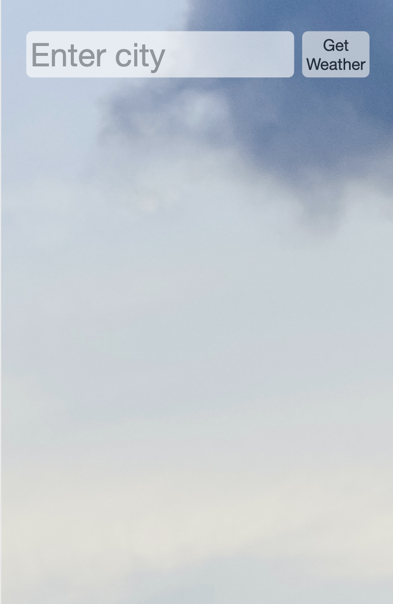
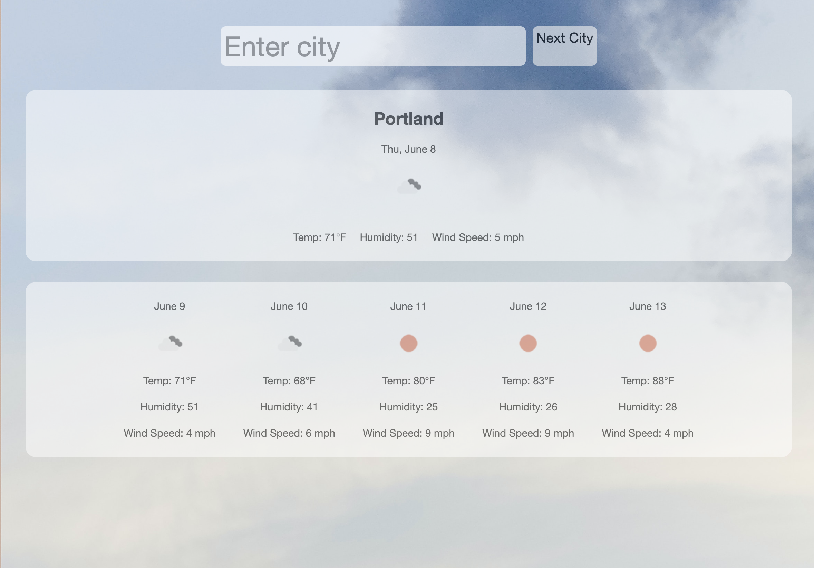
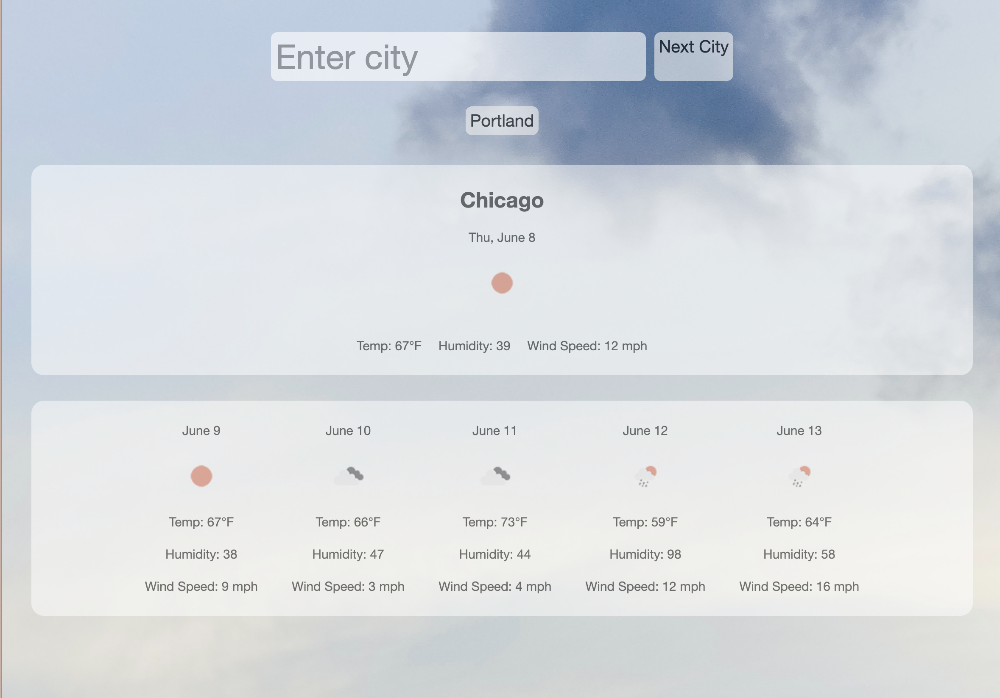

# weather-app
Use API to produce current weather and local storage to save data. 

## Description
This web applciation pulls from Open Weather's APIs to produce current and 5 day weather forcasts for a given city name. This application allows the user to see current date, weather via image, temperature, wind speed, and humidity of a given location. For fun, conditional weather statments have been implemented to give the user subjective weather information. 

## Installation
This code can be downloaded via ZIP file and edited using an IDE.

## Credits
Third party APIs included Open Weather's 5 Day Forecast (https://openweathermap.org/forecast5)

## Screenshot of Deployed Application
Below is an image of the page upon loading:

Below is an image of the first result searched:

Below is an image of the second searched result with proof of search history:
;

## Link for Deployment
https://mereljac.github.io/weather-app/

## Notes
This code is disned for desktop or mobile phones with a media query at 400px.
